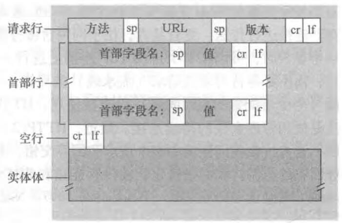
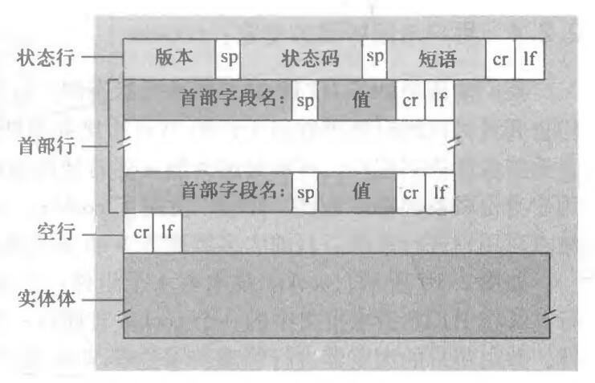

* HTTP服务器不保存关于客户的任何信息，加入某个特定的客户在几秒内连续两次请求同一对象，服务器将会重新发送对象，就像它完全不记得刚刚发生过的事情那样。因此，称HTTP是一个无状态协议。

* 持续连接和非持续连接

  * 非持续连接：每个请求/相应经过一个单独的TCP连接发送
  * 持续连接：每个请求/相应经过同一个TCP连接发送

* HTTP请求报文

  > GET /somedir/page.html HTPP/1.1
  >
  > Host: www.someschool.edu
  >
  > Connection: close
  >
  > User-agent: Mozilla/5.0
  >
  > Accept-language: fr
  >
  > 

  该报文由 5 行组成，每行由一个回车换行符结束，最后一行再附加一个回车换行符。

  一个请求报文能够具有更多行，或者至少一行

  第一行叫请求行，其后继叫首部行

  * 请求行
    * 请求行有三个字段：方法字段，URL 字段和 HTTP 版本字段。
    * 方法字段可以取：GET、POST、HEAD、PUT 和 DELETE。绝大部分 HTTP 请求报文使用 GET 方法。
  * 首部行，以上述报文为例
    * Host: www.someschool.edu
      * 指明了对象所在的主机
      * 虽然该主机中已经存在了 TCP 连接，但该首部行提供的信息是 Web 代理高速缓存所要求的的
    * Connection: close
      * 通过包含该首部行，该浏览器告诉服务器不使用持续连接，它要求服务器在发送完被请求的对象后就关闭这条连接
    * User-agent: Mozilla/5.0
      * 该首部行用来指明用户代理，即向服务器发送请求的浏览器类型。
    * Accept-language: fr
      * 该首部行表示用户想得到该对象的法语版本(如果服务器中有这个对象的话，如果没有，发送默认版本)

  请求报文通用格式：

  

  首部行的空行后有一个实体体，使用 GET 方法时实体体为空，而使用 POST 方法时才使用该实体体。

  * 请求行方法

    * 当用户提交表单时，HTTP 客户常使用 POST 方法，如当用户向搜索引擎提交搜索关键词时。

    * 但用表单生成请求报文并非一定要用 POST，HTML 表单经常使用 GET 方法，并在所请求的 URL 中包括输入的数据。

      例如，一个表单使用 GET 方法，它有两个字段，分别填写“monkeys"和”bananas“，这样，该 URL 结构为：www.somesite.com/animalsearch?monkeys&bananas

    * HEAD 方法类似于 GET 方法。当服务器收到一个 HEAD 方法的请求时，将会用一个 HTTP 报文进行响应，但不返回请求对象。

      应用程序开发者常用 HEAD 方法进行调试跟踪。

    * PUT 方法常与 Web 发行工具联合使用，他允许用户上传对象到指定的 Web 服务器上指定路径。

    * DELETE 方法允许用户或者应用程序删除 Web 服务器上的对象

* HTTP 响应报文

  > HTTP/1.1 200 OK
  >
  > Connection: close
  >
  > Date: Tue, 18 Aug 2015 15:44:04 GMT
  >
  > Server: Apache/2.2.3 (CentOS)
  >
  > Last-Modified: Tue, 18 Aug 2015 15:11:03 GMT
  >
  > Content-Length: 6821
  >
  > Content-Type: text/html
  >
  > 
  >
  > (data ...)

  这个响应报文有三个部分：

  * 1 个初始状态行，有 3 个字段
    * 协议版本字段
    * 状态码
      * 200 OK：请求成功，信息在返回的响应报文中
      * 301 Moved Permanently：请求的对象已经被永久转移了
      * 400 Bad Request：一个通用的差错代码，指示该请求不能被服务器理解
      * 404 Not Found：被请求的文档不在服务器上
      * 505 Http Version Not Supported：服务器不支持请求报文使用的 HTTP 协议版本
    * 相应状态信息
  * 6 个首部行
    * 服务器用 `Connection: close` 首部行告诉客户，发送完报文后将关闭该 TCP 连接。
    * Date：指示服务器产生并发送该报文的时间
    * Server：指示该报文是由一台 Apache Web 服务器产生的，类似于请求报文中的 User-agent
    * Last-Modified：指示了对象创建或者最后修改的时间
    * Content-Length：指示了被发送对象的`字节数`
    * Content-Type：指示了实体体中的对象是 HTML 文本
  * 实体体：报文的主要部分，即它包含了所请求对象本身。

  

  

